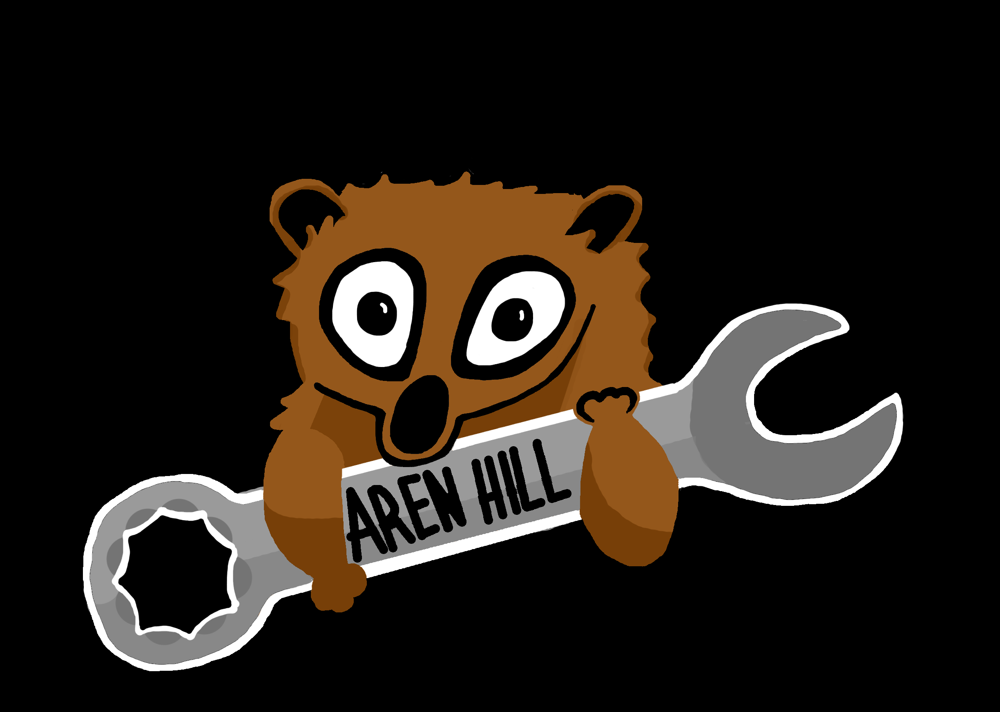
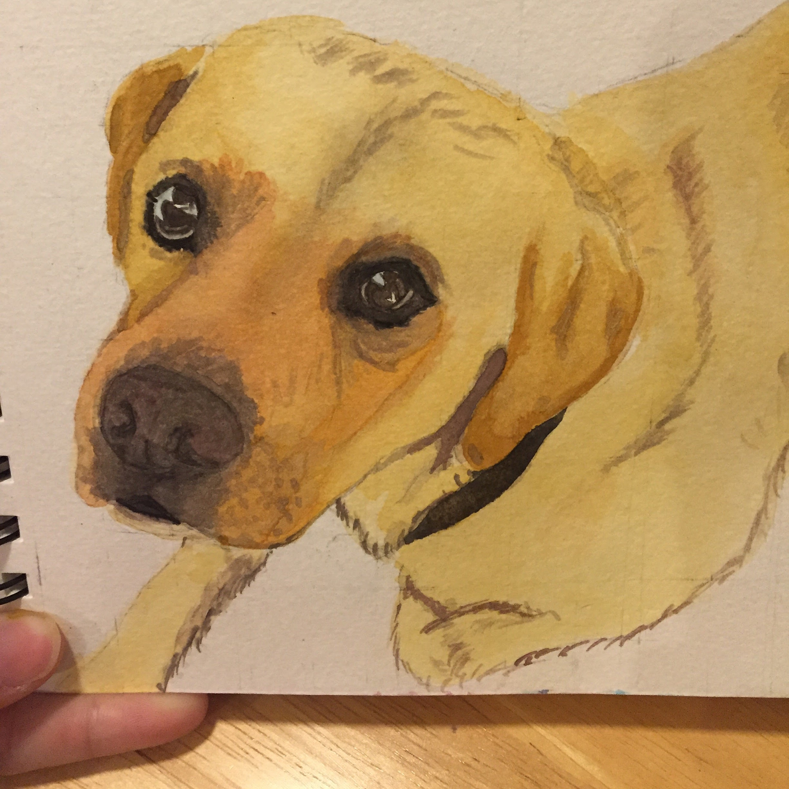
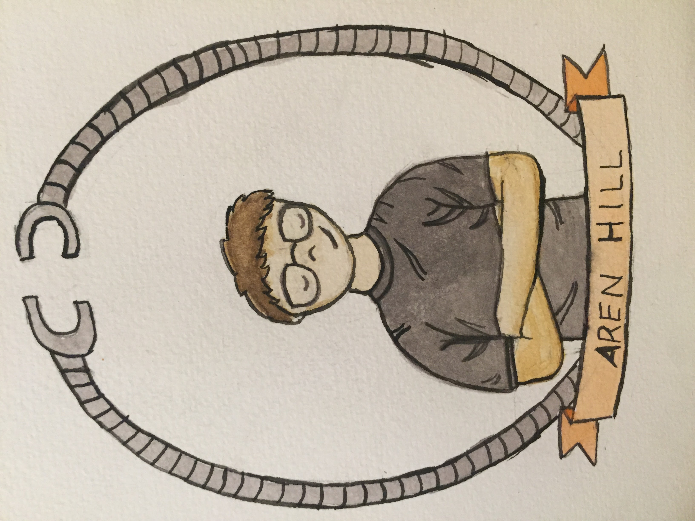
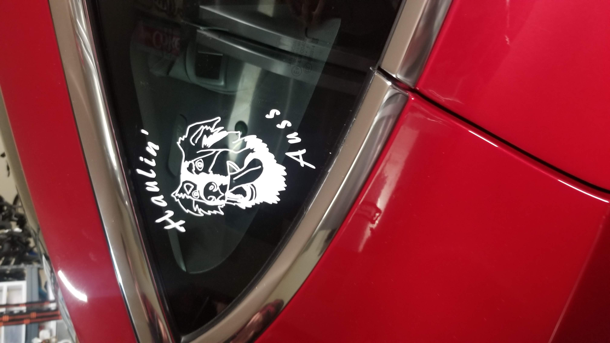
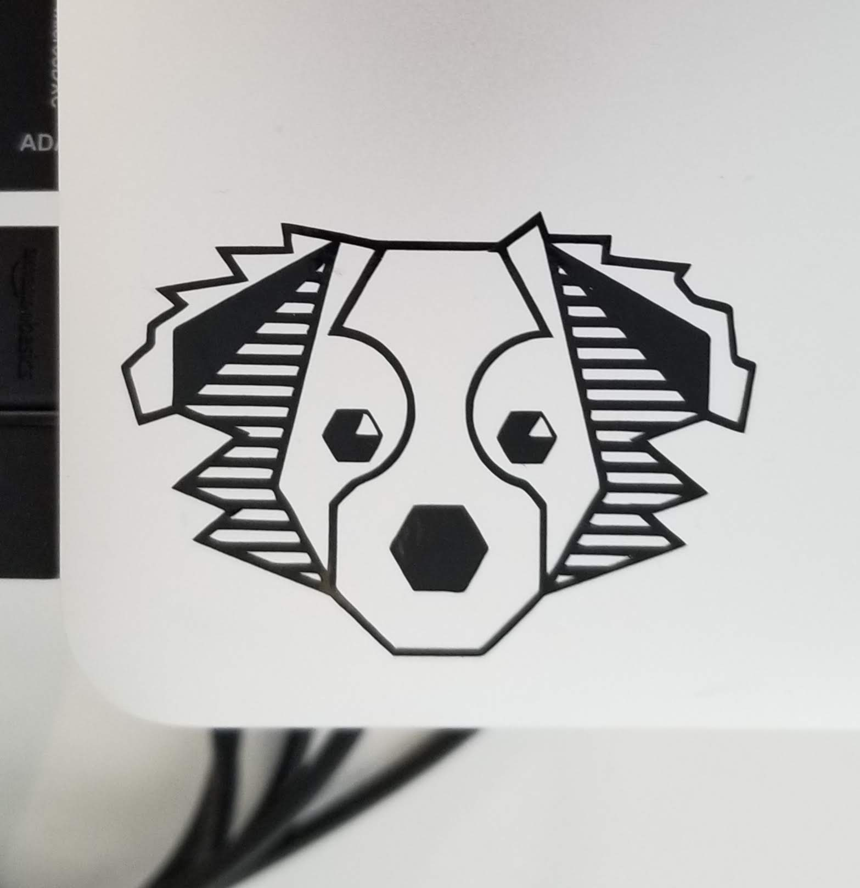

# Port-Faux-lio

Stuff I've drawn

2013 Aren Hill Slow Loris Logos (used by Team Neutrino and ISU Lunabots) 

2015 "Killer Whale" Logo for Team Neutrino (FRC 3928) 

2015 The time when I was really into drawing birds 

2015 Amazing Chicken Pun 

2016 Fox Watercolor 

2016 Murphy Watercolor 

2016 Aren Hill Sucks 

2016 Self Portrait 

2019 Haulin' Auss Vinyl 

2020 Gatsby Vinyl 

2021 Blip Logo & Vinyl

2022 Blip and Tantrum Drawings + Merch

2021-2023 Blip & Tantrum Jerseys

