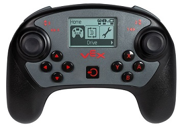
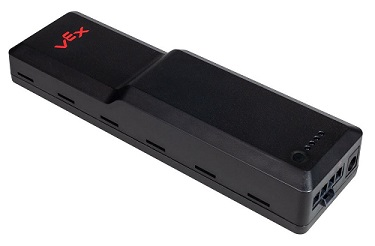

# Projects

### VEX V5 (2016 - Present)

While working at VEX Robotics, I was involved in the creation of VEX V5 - primarily the controller and the battery.

  

The controller is similar to a typically gaming controller with the addition of a screen. The controller utilizes various communication protocols: SPI, I2C, UART. Additionally the controller includes monitoring digital and analog inputs, controlling a small motor with PWM, battery monitoring, and running and managing the GUI. As a creative type, I overhauled the UI design to be easier to navigate and more user friendly. My improvements are being implemented in other product lines. 

Due to the battery chemistry that we chose (Li-Ion), the battery for the new V5 system has to be intelligent as capacity could no longer be determined by voltage. The V5 Battery utilizes a TI cell monitoring chip to count coulombs in and out of the cells and set up and monitor protection systems. The battery also features a bootloader and communcation features. This is the first smart battery that VEX has created.

[Click here](https://www.vexrobotics.com/v5-architecture.html) to learn more tech specs about the system and my products - see Controller and Battery sections

Purchasing pages for products:
[Controller](https://www.vexrobotics.com/vexedr/products/v5-products/276-4820.html) || 
[Battery](https://www.vexrobotics.com/vexedr/products/v5-products/276-4811.html)

### FIRST Robotics Competition (2017 - Present)

[2017 Code](https://github.com/FRC1296/RhsRobot2017) || 
[2018 Code](https://github.com/FRC1296/RhsRobot2018)

For the past two years I have been a lead software mentor for Team 1296 located in Rockwall, TX. Students code in C++ using a framework created by a team member a few years back. Under my instruction students learn about programming syntax, state machines, breaking down problems, various sensors, CAN bus, and PID control loops. The code in 2017 & 2018 is predominantly student code written under my supervision. The skills that students have learned while on the software team have prepared them to take on engineering internships while still in high school. 

### Coolest University Project : Automated Target Detection (2015)

[Project Video](https://youtu.be/f3tUscQhJMU)

This project was using a camera and a USB foam missile launcher to hit a target for my capstone embedded systems course. Connecting the camera to the FPGA and reading its contents were a whole project on their own, and we used that project as a spring board for this one. This project was surprisingly simple, once we were able to map out the hardware locations of the video steam to be read by software and get our USB driver working. We used what's called a state-machine to detect the target. Which section of the frame the target was located in determined what command we sent to the launcher (up/down/left/right/up-left/down-left.../fire). This was a really fun project to work on, although I'm not sure how I feel about writing programs for Kernal space.

note: The problem was given to us in the context of a scenario where aliens are invading, and their weakness is foam tipped darts. Wanting to have fun with the video, I turned this scenario and our footage into a trailer for the fictional movie "MP-3" (title of the lab).

**Other University Projects of Interest:**
* [FPGA SNES Emulator](https://youtu.be/BFT52DaeWSQ)
* [Quadcopter Controls Lab using FPGA and VHDL](https://youtu.be/29ENLdpz1bc)
* [No video] "Mars Rover" - Hacked Roomba with sensors navigates an obstacle field, written in C on an Atmega128 board
* [No video] "Bluetooth speaker" - Transfer audio on one FPGA via bluetooth to a paired FPGA and output to speaker
* ["Tron Game"](https://photos.google.com/share/AF1QipPdMVgY_hRwAq0slDcco6FvEFmOftom9Pw4POQ6P3b_mSEx1mL3ScO6ePG9S70_3g?key=OVB2TmJFNzhtVVA1bDJrNGtsWGpRc19TRTVBTVFR) - Android Tablet to Arduino Uno to LED Array - controls on android touch screen command the Tron Game on LED array via the arduino.

### Lets Learn Programming

[Project Page](https://kwiden.github.io/LetsLearnProgramming/)

My virtual classroom for teaching robotics students how to program _for_ FIRST robotics. The objective is to take a student with 0 programming knowledge and train them to mostly proficient within ~3 months. A large undertaking, the project is constantly being built and improved upon. Some lessons are still "under construction" and others need to be updated as the tools we use change each year. 
